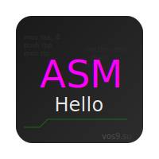

# hallo_world_asm

<div align="center">
  
  <p><em>Modern Assembly Hello World with Style</em></p>
</div>

A colorful "Hello World" program written in x86_64 assembly for macOS, featuring:
- Colored text output using ANSI escape codes
- Error handling
- 0.5 second delay between messages

## 🚀 Requirements
- macOS 11.0 or later
- NASM assembler
- Command line tools

## 🛠 Installation
```bash
git clone https://github.com/yourusername/hallo_world_asm.git
cd hallo_world_asm
```

## 🎯 Usage
1. Run `make all` to build the program
2. Run `make run` to execute the binary
3. Run `make clean` to remove generated files

## ✨ Features
- 🟥 Red "Привет" message
- 🟩 Green "мир!" message
- ⚠️ Error handling with stderr output
- 🔄 Clean exit with proper stack handling

## 🔍 Technical Details
The program demonstrates:
- ANSI color code usage
- System calls optimization
- Proper UTF-8 string handling
- Stack frame management

## 📝 License
MIT License

